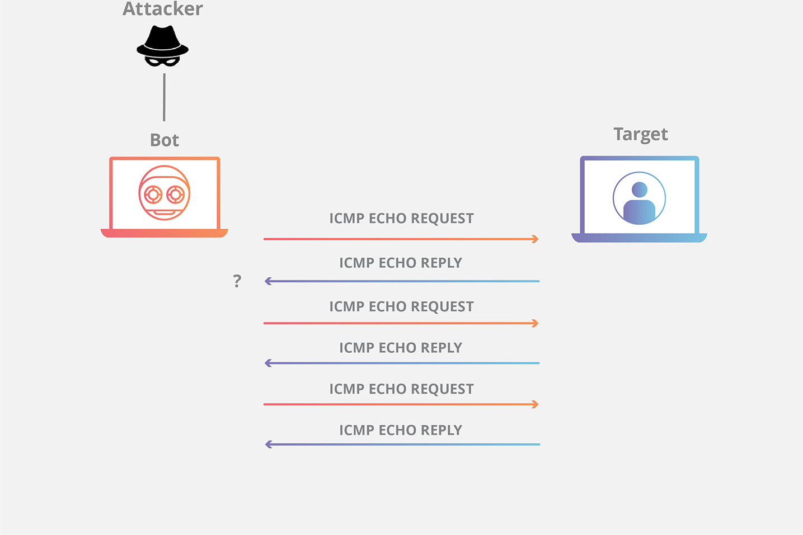
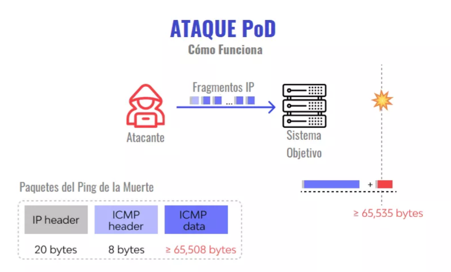
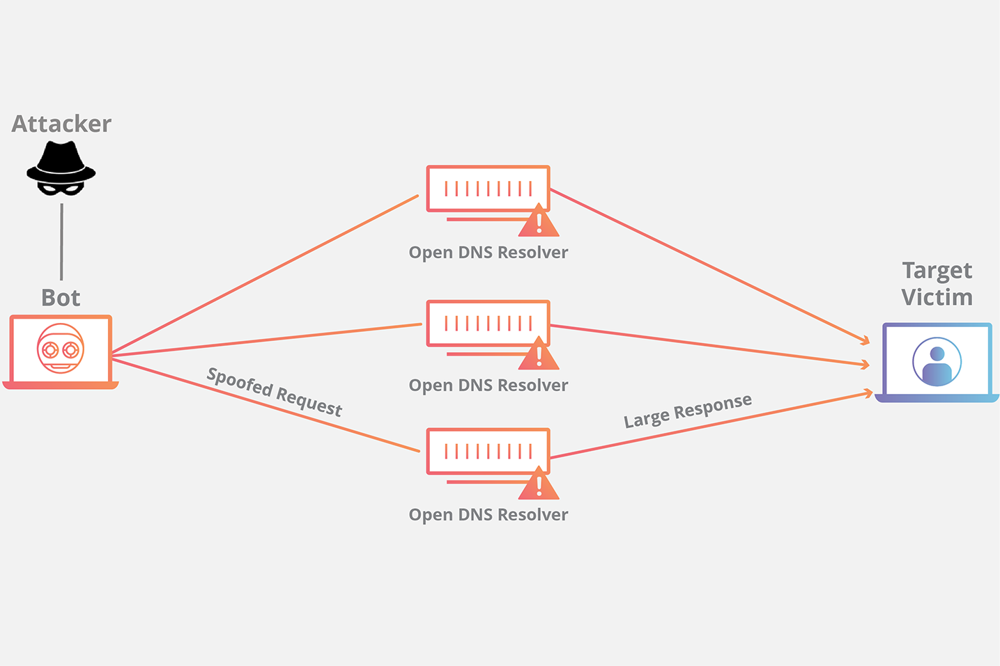
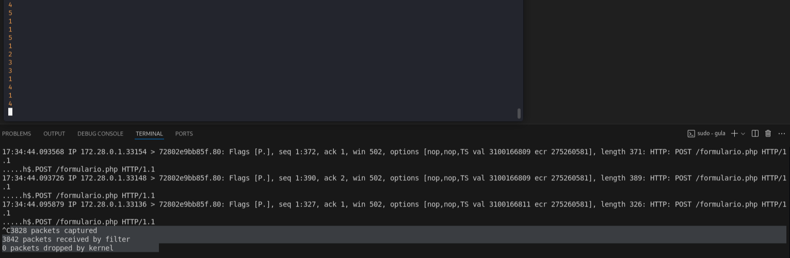

= Gula
:author: Manuel L. Quero
:revdate: 2025-03-31
:toc: left
:doctype: book

<<<

== Ataques DDoS y DoS

Los ataques distribuidos de denegación de servicio (DDoS) son aquellos que se producen cuando un atacante envía tráfico artificial desde varios dispositivos a los servidores que hospedan una web o una aplicación para que estos dejen de estar disponibles para los usuarios; existen diferentes tipos de ataques DDoS, pero todos tienen el mismo fin: saturar un servidor con tráfico ilegítimo, para detener la operatividad de un servicio en línea de forma temporal o permanente.

Por otra parte tenemos los ataques de denegación de servicio (DoS) donde solo proviene de una sola fuente.

=== ¿Cómo se producen los ataques DDoS?

. Para generar ese tráfico artificial, primeramente necesitaríamos muchos ordenadores, es decir, obtener el servicio de una botnet. Para ello se infectan con malware dispositivos, creando ordenadores zombie. Una vez se tienen varios dispositivos infectados se configuran los servidores de comando y control (C2) para manejar la botnet.

. El atacante enviará órdenes a los bots para comenzar a generar tráfico masivo hacia los servidores víctima. Estos ataques utilizan diferentes técnicas para enviar paquetes de datos hacia el objetivo, los cuales veremos más adelante.

. Una vez que está en marcha el ataque, el servidor colapsará debido a la saturación del tráfico. Desde el punto de vista de un cliente, experimentarán ralentización o falta de acceso.

. Los atacantes desde este punto, si ven que ha sucumbido el servidor ante su ataque pueden o pedir un rescate a la víctima (ransom DDoS) o aprovechar esto y hacer otro tipo de ataques (exfiltración de datos, inyección de malware, etc.).

. Este ataque es más difícil de mitigar, ya que proviene de múltiples IPs.

=== ¿Cómo se producen los ataques DoS?

Este es el caso sobre el que trata la máquina y sobre el que nos vamos a centrar, ya que no se suele tener una botnet al uso, por lo que utilizaremos nuestro propio dispositivo. 

. Como indica el nombre este ataque ya no es distribuido, asi que solamente se realiza desde un solo dispositivo o IP.

. El atacante hace un envío masivo de peticiones o explotación de vulnerabilidades desde una única máquina. Y se espera a que se consuman todos los recursos del servidor (CPU, memoria, ancho de banda).

. Como podemos observar la finalidad es la misma que la del ataque DDoS, unicamente que este requiere menos recursos y es más sencillo de mitigar, ya que se puede banear la IP exacta que envía tantas peticiones por segundo, aunque ya veremos más adelante cómo mitigar este tipo de ataques.

== Tipos de ataques DoS y DDoS

Los ataques pueden clasificarse en varios tipos según el método de ataque utilizado. Principalmente pueden enfocarse en agotar recursos, explotar vulnerabilidades, amplificar tráfico o saturar conexiones. Hay que tener en cuenta que, aunque no se comente, en todos los ataques se https://www.cloudflare.com/es-es/learning/ddos/glossary/ip-spoofing/[suplanta la IP].

=== 1. Ataques de Consumo de Recursos

Estos ataques buscan agotar los recursos del sistema, como CPU, memoria o ancho de banda, para que no se pueda responder a solicitudes legítimas.

==== a. Ping flood (ICMP)

En este, el atacante intenta sobrecargar un dispositivo objetivo con paquetes de solicitud de eco ICMP, es decir, a base de pings se intenta saturar el ancho de banda.

Una solicitud ICMP requiere algunos recursos del servidor para procesar cada solicitud y para enviar una respuesta. La solicitud también requiere ancho de banda tanto en el mensaje entrante (solicitud de eco) como en la respuesta saliente (respuesta de eco). El ataque de inundación de Ping pretende sobrecargar la capacidad del dispositivo objetivo para responder al elevado número de solicitudes y/o sobrecargar la conexión de red con tráfico falso.

. El atacante envía muchos paquetes de solicitud de eco de ICMP al servidor objetivo utilizando varios dispositivos.

. A continuación, el servidor objetivo envía un paquete de respuesta de eco de ICMP a la dirección IP de cada dispositivo solicitante como respuesta.

==== b. SYN Flood

En este caso se envian repetidamente paquetes de solicitud de conexión inicial (SYN), el atacante puede sobrecargar todos los puertos disponibles en el servidor víctima, lo que hará que el dispositivo responda al tráfico legítimo muy lentamente o incluso que no responda en absoluto.

Este ataque aprovecha el proceso de las conexiones TCP. Como ya sabemos, en una situación normal se producen los siguientes procesos:

En un ataque se aprovecha el hecho de que, después de que se ha recibido un paquete SYN inicial, el servidor responderá con uno o más paquetes SYN/ACK y esperará el paso final del protocolo de enlace. Así es como funciona:

. El atacante envía muchos paquetes SYN al servidor víctima, generalmente mediante una dirección IP falsificada.

. El servidor víctima entonces responde a cada una de las solicitudes de conexión y deja abierto un puerto listo para recibir la respuesta.
    
. Mientras el servidor espera a que llegue el paquete ACK final, el cual nunca llegará, el atacante sigue enviando más paquetes SYN. La llegada de cada nuevo paquete SYN hace que el servidor mantenga temporalmente abierta una nueva conexión de puerto durante cierta cantidad de tiempo y, una vez que se hayan utilizado todos los puertos disponibles, el servidor ya no puede funcionar con normalidad, llevándolo a su sobrecarga.

image::assets/syn-flood-2.png[SYN flood]

También hay varios formas de llevarlo a cabo:

* *Ataque directo*: El atacante envía paquetes SYN sin falsificar la IP, pero bloquea respuestas SYN-ACK para mantener el ataque activo.
* *Ataque con suplantación*: Se falsifica la dirección IP en los paquetes SYN para dificultar la mitigación y el rastreo del atacante.
* *Ataque distribuido (DDoS)*: Se usa una botnet para generar un ataque masivo, con dispositivos que pueden falsificar sus IPs, haciendo el rastreo casi imposible.

==== c. UDP Flood

En este ataque lo que se pretende es enviar paquetes UDP a puertos aleatorios, forzando al servidor a responder con "puerto inalcanzable". 

De normal, un servidor responde a un paquete UDP enviado a uno de sus puertos de la siguiente forma:

. El servidor comprueba primero si se está ejecutando algún programa que esté escuchando solicitudes en el puerto especificado.

. Si ningún programa recibe paquetes en ese puerto, el servidor responde con un paquete ICMP (ping) para informar al remitente de que no se podía alcanzar el destino.

Entoces, si tiene que realizar este proceso para una petición, podemos llegar a imaginar que ocurre si se envían muchas peticiones. Como resultado de que el servidor víctima utiliza recursos para comprobar y luego responder a cada paquete UDP recibido, los recursos del objetivo pueden agotarse muy rápido cuando se recibe una gran avalancha de paquetes UDP, lo que provoca una denegación de servicio al tráfico normal.

image::assets/udp-flood.png[UDP Flood]

=== 2. Ataques de Explotación de Vulnerabilidades

Aprovechan fallos en el software o protocolo de red para hacer que el sistema colapse.

==== a. Slowloris

https://github.com/gkbrk/slowloris[Slowloris] es un programa que permite que un atacante sobrecargue un servidor objetivo al abrir y mantener muchas conexiones simultáneas HTTP entre el atacante y el objetivo.

El ataque se produce en la *capa de aplicación* y funciona al abrir conexiones a un servidor web objetivo y mantener esas conexiones abiertas todo el tiempo que se pueda. Slowloris es una herramienta de ataque específica diseñada para permitir que una sola máquina derribe un servidor sin utilizar mucho ancho de banda, en su lugar tiene como objetivo utilizar los recursos del servidor con solicitudes que parecen más lentas de lo normal, pero que por lo demás imitan el tráfico regular. 

El servidor atacado solo tendrá un número determinado de hilos disponibles para gestionar conexiones concurrentes. Cada hilo del servidor intentará mantenerse en servicio mientras espera a que se complete la solicitud lenta, lo cual nunca ocurre. Cuando se haya superado el máximo de conexiones posibles del servidor, no se responderá a cada conexión adicional y se producirá una denegación de servicio.

Este ataque se produce en 4 pasos:

. El atacante abre múltiples conexiones al servidor objetivo mediante el envío de múltiples encabezados de solicitudes HTTP parciales.

. El objetivo es abrir un hilo para cada solicitud entrante, con la intención de cerrar el hilo una vez que se haya completado la conexión. Para ser eficiente, si una conexión tarda demasiado, el servidor agotará el tiempo de la conexión excesivamente larga, liberando el hilo para la siguiente solicitud.

. Para evitar que el objetivo agote las conexiones, el atacante envía periódicamente encabezados de solicitud parciales al objetivo para mantener activa la solicitud. Básicamente, dice: "¡Todavía estoy aquí! Solo soy lento, por favor, espérame".

. El servidor objetivo nunca es capaz de liberar ninguna de las conexiones parciales abiertas mientras espera a que termine la solicitud. Una vez que todos los hilos disponibles están en uso, el servidor será incapaz de responder a las solicitudes adicionales realizadas desde el tráfico regular, provocando una denegación de servicio.

image::assets/Slowloris.jpg[Slowloris]

==== b. Teardrop Attack

En este caso se usan paquetes fragmentados de datos para inundar el servidor o la red de una víctima. Dado que el servidor no puede volver a ensamblar los paquetes, se produce una sobrecarga del servidor.

Los datos, o el tráfico de la red, suelen desglosarse en pequeños fragmentos y, luego, etiquetarse con un número específico en lo que se conoce como el campo "Fragment Offset". Volver a organizarlos en el orden correcto una vez que llegan es lo que suele suceder cuando no hay un ataque de por medio.

Entonces durante un ataque Teardrop, el ciberdelincuente inyecta un error en el campo "Fragment Offset", que interrumpe el proceso de resecuenciamiento. Como resultado, el sistema recolecta un grupo grande de datos fragmentados dañados que no se pueden volver a ensamblar adecuadamente. Lamentablemente, tu sistema se sobrecarga y se bloquea sin advertencias (adecuadas).

Este ataque afectaba principalmente a sistemas antiguos como Windows 95, NT y algunas versiones de Linux

image::assets/Teardrop.jpg[Teardrop]

==== c. Ping of Death (PoD)

Este ataque es el precursos del *Ping flood* visto anteriormente. Consiste en el envio de paquetes más extensos que el tamaño máximo de paquetes de una conexión a Internet.

Estos paquetes son superior a 65,535 bytes, lo que provoca errores de reensamblaje en sistemas antiguos y puede causar fallos del sistema o reinicios. Este ataque aprovecha vulnerabilidades específicas en el manejo de fragmentación de paquetes de ciertos sistemas operativos más antiguos.

=== 3. Ataques de Amplificación y Reflexión

Utilizan servidores de terceros para amplificar el tráfico hacia la víctima, generando un volumen de datos inmenso. Todos los ataques de amplificación aprovechan una disparidad en el consumo de ancho de banda entre un atacante y el recurso web objetivo.

==== a. DNS Amplification

En este ataque un atacante aprovecha la funcionalidad de los solucionadores de DNS abiertos para sobrecargar una red o servidor específico con una cantidad amplificada de tráfico, impidiendo el acceso.

Consiste en enviar consultas breves que derivan en extensas respuestas que permiten aumentar el volumen del tráfico, produciendo la caida del servidor. También hay que tener en cuenta el efecto devastador que tiene esto realizado por una botnet.

Este ataque se ejecuta de la siguiente manera:

. El atacante utiliza un punto de conexión en riesgo para enviar paquetes UDP con direcciones IP falsificadas a un recursor de DNS. La dirección falsificada en los paquetes señala a la dirección IP real de la víctima.

. Cada uno de los paquetes UDP realiza una solicitud a un solucionador de DNS, que a menudo aprueba un argumento como "CUALQUIERA" para recibir la respuesta más extensa posible.

. Después de recibir las solicitudes, el solucionador de DNS, que intenta ser útil respondiendo, envía una respuesta extensa a la dirección IP falsificada. 

. La dirección IP del servidor recibe la respuesta y la infraestructura de red asociada se ve inundada por una avalancha de tráfico, produciendo la denegación de servicio.

==== b. NTP Amplification

En este ataque se aprovecha la funcionalidad de un servidor NTP (protocolo de tiempo de red) para sobrecargar una red o servidor específico con una cantidad amplificada de tráfico UDP, lo que impide al tráfico normal acceder al servidor víctima.

Lo que se pretende es explotar el comando monlist en servidores NTP vulnerables para multiplicar el tráfico de solicitud, generando una respuesta hasta 206 veces mayor, permitiendo a un atacante amplificar su ataque de DDoS con un impacto masivo.

Este ataque se realiza de la siguiente manera:

. El atacante utiliza una red de bots para enviar paquetes UDP con direcciones IP falsificadas a un servidor NTP que tiene el comando monlist activado. La dirección IP falsificada en cada paquete se dirige a la dirección IP real de la víctima.

. Cada paquete UDP hace una solicitud al servidor NTP utilizando su comando monlist, lo que provoca una extensa respuesta.

. El servidor responde entonces a la dirección falsificada con los datos resultantes.

. La dirección IP del servidor recibe la respuesta y la infraestructura de red asociada se ve sobrecargada por la avalancha de tráfico, con la consiguiente denegación de servicio.

==== c. Memcached Amplification

En este caso el atacante falsifica las solicitudes a un *servidor memcached* UDP vulnerable, que luego inunda a la víctima objetivo con tráfico de Internet, lo que puede llegar a sobrecargar los recursos de la misma. Mientras está sobrecargada la infraestructura de Internet del objetivo, no se pueden procesar nuevas solicitudes, por lo que se produce la denegación de servicio.

*Memcached* es un sistema de almacenamiento en caché de bases de datos para acelerar sitios web y redes.

El ataque funciona como los anteriores que hemos visto sobre amplificación, ya que se envían solicitudes falsas a un servidor vulnerable, que luego responde con una mayor cantidad de datos que la solicitud inicial, magnificando el volumen de tráfico. Este método de ataque de amplificación es posible ya que los servidores de memcached tienen la opción de funcionar con el protocolo UDP. UDP se utiliza porque nunca se consulta al host objetivo si está o no dispuesto a recibir los datos, lo que permite enviar una gran cantidad de datos al objetivo sin su consentimiento previo.

Un ataque basado en memcached se produce:

. Un atacante implanta una gran *carga útil* de datos en un servidor memcached en riesgo.

. A continuación, el atacante falsifica una solicitud HTTP GET con la dirección IP de la víctima.

. El servidor de memcached vulnerable que recibe la solicitud, que intenta ser útil respondiendo, envía una respuesta extensa al objetivo.

. El servidor objetivo o su infraestructura es incapaz de procesar la gran cantidad de datos enviados desde el servidor memcached, lo cual provoca una sobrecarga y una denegación de servicio a las solicitudes legítimas.

Ejemplo de ataque mecached:

=== 4. Ataques Lógicos o de Estado

Estos ataques aprovechan la gestión de conexiones del sistema para hacer que los recursos se agoten.

==== a. HTTP Flood

La intención de este ataque es saturar un servidor objetivo con solicitudes HTTP, en la capa de aplicación. Normalmente se utilizan botnets para este tipo de ataques.

image::assets/http-flood-attack.png[HTTP Flood]

Hay dos variantes:

*Ataque HTTP GET*

Varios dispositivos envian múltiples solicitudes de imágenes, archivos o algún otro activo desde un servidor objetivo. Cuando el objetivo se vea inundado con solicitudes y respuestas entrantes, se producirá una denegación de servicio

*Ataque HTTP POST*

Este tipo de ataque se hace a través de los formularios, donde se suelen enviar los datos a una base de datos. El proceso de gestionar los datos del formulario y ejecutar los comandos necesarios de la base de datos es relativamente intensivo en comparación con la cantidad de potencia de procesamiento y el ancho de banda que se necesita para enviar la solicitud POST. Este ataque utiliza la disparidad en el consumo relativo de recursos, al enviar muchas solicitudes POST directamente a un servidor objetivo hasta que se sature su capacidad

==== b. RUDY (R U Dead Yet?)

https://github.com/sahilchaddha/rudyjs[RUDY] es una herramienta cuyo objetivo es mantener un servidor web atado al enviar datos de formularios a un ritmo muy lento. La herramienta detecta los campos del formulario y aprovecharse del proceso de envío del mismo.

Un ataque R.U.D.Y. se realiza en los siguientes pasos:

. La herramienta R.U.D.Y. rastrea la aplicación de la víctima en busca de un campo de formulario.

. Cuando encuentra un formulario, la herramienta crea una solicitud POST HTTP para imitar el envío de un formulario legítimo. Esta solicitud POST contiene un encabezado que alerta al servidor de que se va a enviar un contenido muy extenso.

. Luego, la herramienta alarga el proceso de envío de los datos del formulario al dividirlo en paquetes de hasta 1 byte cada uno, y al enviar estos paquetes al servidor a intervalos aleatorios de unos 10 segundos cada uno.

. La herramienta sigue enviando datos de forma indefinida. El servidor web mantendrá la conexión abierta para aceptar los paquetes, ya que el comportamiento del ataque es similar al de un usuario con una velocidad de conexión lenta que envía datos de un formulario. Entretanto, se ve afectada la capacidad del servidor web para manejar el tráfico legítimo, por lo que termina saturándose.

<<<

== Solucionar la máquina

Vamos a ver en esta guía cómo realizar ataques de denagación de servicios y cómo estos afectan a un servidor mal configurado. Aprenderemos principalmente cómo realizarlos y ver lo que ocurre en nuestra máquina.

Para ello utilizaremos varias herramientas que estarán disponibles en el contenedor *dos*:

* https://www.kali.org/tools/hping3/[hping3]
* https://github.com/gkbrk/slowloris[slowloris]
* ping
* https://github.com/C4PIT4L/TearDrop[TearDrop]
* https://github.com/LimerBoy/Impulse[Impulse]
* https://github.com/sahilchaddha/rudyjs[Rudyjs]
* https://github.com/rodarima/lsi/blob/master/p2/dnsdrdos.c[dnsdrdos.c]

Sería conveniente utilizar una distribución Linux, es recomendable usar Kali Linux.

=== Despliegue de la máquina

Como requisito, necesitaremos tener instalado docker y docker-compose.

Podemos ver como instalar docker para varias distribuciones de linux -> https://docs.docker.com/engine/install/[Instalar Docker]

Podemos ver como instalar docker-compose para varias distribuciones de linux -> https://docs.docker.com/compose/install/linux/[Instalar Docker-Compose]

Necesitaremos descargar primeramente el auto_deploy.sh, el cual se muestra como una pirámide en la página. Después en un directorio deberemos tener el auto_deploy.sh, gula.tar y docker-compose.yml, deberemos acceder con la terminal a dicho directorio y ejecutar el siguiente comando. 

(Si el auto_deploy no tiene permisos se los damos mediante *chmod +x*). 

[source,bash]
----
$ sudo bash auto_deploy.sh gula.tar
----

Tendremos tres imagenes, dos son del servidor y la otra es un entorno de ataque, donde están todas las herramientas configuradas y listas para usar. Si queremos usar este entorno, en una terminal ponemos:

[source,bash]
----
$ sudo su
$ docker exec -ti dos /bin/bash
----

En caso de querer comprobar el servidor con *tcpdump*, deberemos acceder al contenedor de nginx:

[source,bash]
----
$ sudo su
$ docker exec -ti nginx /bin/bash
----

También podemos ver las estadísticas de los contenedores poniendo *docker stats* en la terminal.

En cuanto a acceder a la página, es recomendable crear un nuevo perfil en nuestro navegador y borrar la cache de este por cada ataque. De esta forma comprobaremos que se ha realizado o no, sería como entrar por primera vez.

[cols="1,1"]
|===
|Navegador|URL

|Firefox
|about:profiles

|Brave
|brave://settings/manageProfile

|Chrome
|chrome://settings -> "Personas"

|Opera
|opera://settings/side-profiles-settings
|===

==== Nociones básicas

* *tcpdump* -> Es una herramienta de línea de comandos utilizada para capturar y analizar el tráfico de red en tiempo real. Permite inspeccionar los paquetes que circulan por una interfaz de red, filtrar tráfico específico por protocolos, direcciones IP o puertos, y visualizar detalles sobre las conexiones de red. Es útil para diagnosticar problemas de red, auditar la seguridad o estudiar el comportamiento de aplicaciones en la red.

* *docker stats* -> Muestra información en tiempo real sobre el rendimiento de los contenedores en ejecución. Los datos que proporciona son útiles para monitorear el consumo de recursos y detectar posibles problemas de rendimiento.

- *CPU %* -> Indica el porcentaje de uso de la CPU por parte del contenedor. Es útil para detectar si un contenedor está consumiendo demasiados recursos de procesamiento.
- *MEM USAGE / LIMIT* -> Muestra la cantidad de memoria RAM utilizada por el contenedor, junto con el límite de memoria asignado. Esto permite ver si un contenedor está alcanzando su límite de memoria, lo que podría llevar a que se detenga o se vuelva inestable.
- *MEM %* -> El porcentaje de la memoria total asignada al contenedor que está siendo utilizada.
- *NET I/O* -> Muestra la cantidad de datos que el contenedor ha enviado y recibido por la red. Esta cifra es útil para evaluar si el contenedor está generando un alto volumen de tráfico de red, lo que podría indicar que está manejando grandes cantidades de datos o que está siendo atacado
- *BLOCK I/O* -> Muestra la cantidad de datos leída y escrita por el contenedor en el sistema de almacenamiento (disco). Es útil para detectar cuellos de botella en el rendimiento del contenedor relacionados con el acceso a disco.
- *PIDS* -> El número de procesos activos dentro del contenedor. Si este número es muy alto, puede indicar que el contenedor está ejecutando demasiados procesos.

=== 1. Ataques de Consumo de Recursos

==== a. Ping flood (ICMP)

===== Comando

[source,bash]
----
$ sudo hping3 --icmp -flood -a (IPspoof) (IP)
----

Mediante este comando podremos enviar muchos paquetes ICMP como hemos visto anteriormente, con nuestra IP falsificada.

. *hping3* -> Es una herramienta para generar paquetes de red personalizados y hacer pruebas de red o ataques de denegación de servicio (DoS).

. *--icmp* -> Indica que se van a enviar paquetes ICMP (tipo "ping"), similares a los enviados por el comando ping.

. *--flood* -> Envía paquetes lo más rápido posible sin esperar respuesta, generando un gran volumen de tráfico.

. *-a (IPspoof)* -> Usa IP spoofing, es decir, falsifica la dirección IP de origen, haciendo que el ataque parezca provenir de otra máquina.

===== Resultados del ataque

*Limitaciones del entorno local*

El ataque está diseñado para saturar el ancho de banda de un servidor remoto.

En nuestro caso, tanto el atacante como el servidor están en la misma máquina o en la misma red local, lo que elimina la latencia de la red y la congestión del tráfico externo.

Al no haber una "distancia" real que recorrer para los paquetes, el tráfico no se propaga como en un ataque real.

*Análisis del tráfico con tcpdump*

Si ejecutamos el ataque y analizamos el tráfico desde el servidor Nginx con tcpdump, podemos ver cómo se reciben las peticiones.

[source,bash]
----
$ tcpdump -i eth0 icmp
----

En los resultados, observamos que solo 481825 paquetes han sido capturados de un total de 7786662 paquetes filtrados, el resto ha sido descartado por el kernel.

Esto ocurre porque el sistema no puede manejar un volumen tan alto de paquetes, por lo que los descarta antes de procesarlos.

*Monitoreo con docker stats*

image::assets/imagenes-vuln/1/Pingflood/dockerstats.png[Dockerstats]

Al revisar docker stats durante el ataque, no se observan cambios significativos en el uso de recursos.

Lo único que aumenta es el Net I/O de Nginx, ya que está recibiendo las solicitudes maliciosas.

Sin embargo, como los paquetes son descartados antes de ser procesados, el ancho de banda real no se ve afectado.

==== b. SYN Flood

===== Comando

Mediante el siguiente comando enviaremos un ataque SYN flood con direcciones IP falsificadas para saturar la tabla de conexiones del servidor y hacer que deje de aceptar conexiones legítimas.

[source,bash]
----
$ sudo hping3 -c 15000 -d 120 -S -w 64 -p 80 --flood --rand-source (IP)
----

. *hping3* -> Es una herramienta de red utilizada para enviar paquetes TCP/IP personalizados. Es muy útil para pruebas de red y ataques de denegación de servicio (DoS).

. *-c 15000* -> Indica el número de paquetes a enviar, en este caso, 15,000 paquetes.

. *-d 120* -> Establece el tamaño del payload de cada paquete a 120 bytes.

. *-S* -> Establece el flag SYN en el paquete TCP. Esto es clave para un ataque SYN flood, ya que inicia una conexión TCP sin completar el "handshake".

. *-w 64* -> Define el tamaño de la ventana TCP. Esto es el tamaño de la ventana de recepción de datos en el protocolo TCP.

. *-p 80* -> Especifica el puerto de destino. En este caso, el puerto 80, que es utilizado por HTTP.

. *--flood* -> Envía paquetes lo más rápido posible sin esperar respuesta, generando un gran volumen de tráfico.

. *--rand-source* -> Hace que la fuente de los paquetes sea aleatoria, lo que dificulta el rastreo del origen del ataque (hace que el ataque sea de tipo "spoofed").

===== Resultados del ataque

*Inicio del ataque*

Una vez que iniciamos el ataque, es recomendable esperar unos segundos para que su efecto se refleje en el servidor.

*Verificación del efecto*

Para comprobar si el ataque ha tenido éxito, intentamos acceder a la IP del servidor desde el navegador.

Es importante limpiar la caché del navegador o usar un perfil nuevo para evitar datos almacenados. (Esta recomendación puede incluirse en la parte de despliegue del documento).

image::assets/imagenes-vuln/1/SYNflood/cargando.png[Cargando]

Como podemos ver, el servidor no responde y la página no carga. Esto indica que el ataque ha sido exitoso y está afectando la disponibilidad del servicio.

*Análisis con tcpdump*

Durante un breve escaneo con tcpdump, observamos que se han capturado 21 paquetes de un total de 3955070 paquetes procesados, el resto ha sido descartado por el kernel.

[source,bash]
----
$ tcpdump -i any 'tcp[tcpflags] & (tcp-syn) != 0 and tcp[tcpflags] & (tcp-ack) == 0'
----

Esto indica que hay una gran cantidad de paquetes SYN intentando establecer conexiones, lo que reduce progresivamente la disponibilidad del servidor para aceptar clientes legítimos.

*Análisis del impacto con docker stats*

Al monitorear el servidor con docker stats, observamos un Net I/O de 4.68GB / 4.27MB.

Esto sugiere que la carga de red es muy elevada, lo que aumenta las probabilidades de que algunos paquetes logren completar el handshake y consuman recursos del servidor.

image::assets/imagenes-vuln/1/SYNflood/dockerstats.png[Dockerstats]

==== c. UDP Flood

===== Comando

[source,bash]
----
$ sudo hping3 --udp -p 53 -d 120 --flood (IP)
----

. *hping3* -> Es una herramienta para generar paquetes de red personalizados y hacer pruebas de red o ataques de denegación de servicio (DoS).

. *--udp* -> Envía paquetes UDP en lugar de los predeterminados TCP.

. *-p 53* -> Especifica el puerto de destino, en este caso 53 (DNS) (Otros puertos que se pueden usar son 123 (NTP) y 161 (SNMP) ya que van por UDP)

. *-d 120* -> Define el tamaño de los paquetes en 120 bytes.

. *--flood* -> Envía paquetes lo más rápido posible sin esperar respuesta, generando un gran volumen de tráfico.

===== Resultados del ataque

*Inicio del ataque*

Este ataque no lo podemos realizar en nuestro entorno. Esto es debido a que no hay ancho de banda involucrado, ocurriendo el mismo caso que en el ataque de ping flood. Cuando el puerto de destino no está abierto, el sistema responde con un paquete ICMP (ping). Al ejecutarse en un entorno local, no se genera tráfico significativo, por lo que no se pueden observar efectos claros en la red.

*Análisis con tcpdump*

Durante un breve escaneo con tcpdump, observamos que se han capturado 71323 paquetes de un total de 2390095 paquetes procesados, el resto de los paquetes ha sido descartado por el kernel.

[source,bash]
----
$ tcpdump -i any udp
----

Esto indica que el ataque se está ejecutando correctamente y que los paquetes están llegando al servidor. Sin embargo, al no haber distancia real en la red ni consumo de ancho de banda, los efectos son mínimos en este entorno.

image::assets/imagenes-vuln/1/UDPflood/tcpdump.png[Tcpdump]

*Análisis del impacto con docker stats*

Al monitorear el servidor con docker stats, observamos un Net I/O de aproximadamente 5.9GB / 600KB.

Esto sugiere que el servidor está recibiendo una gran cantidad de paquetes, pero no está generando una respuesta significativa en términos de tráfico saliente. Esto confirma que, aunque el ataque está en marcha, en un entorno local no se logra un impacto real en el rendimiento del servidor.

image::assets/imagenes-vuln/1/UDPflood/dockerstats.png[Dockerstats]

=== 2. Ataques de Explotación de Vulnerabilidades

==== a. Slowloris

===== Requisitos

Deberemos tener antes python3 instalado (Debian/Ubuntu):

[source,bash]
----
$ sudo apt upgrade
$ sudo apt install python3 python3-pip python3-dev python3-venv build-essential
----

En caso de usar otra distribución mira esto -> https://www.geeksforgeeks.org/how-to-install-python-on-linux/

Descargamos la herramienta, para ello tenemos dos opciones:

*Pip install*:

[source,bash]
----
$ sudo pip3 install slowloris
$ slowloris example.com
----

*Git clone*:
[source,bash]
----
$ git clone https://github.com/gkbrk/slowloris.git
$ cd slowloris
$ python3 slowloris.py example.com
----

===== Comando

En este caso, es recomendable usar varias terminales con este comando, de esta forma es más rápido el ataque.

[source,bash]
----
$ sudo slowloris (IP)
----

===== Resultados del ataque

Este ataque ha sido exitoso en nuestro entorno; no solo impide el acceso a la página, sino que la ha dejado completamente inaccesible.

*Verificación del efecto*

Accedemos con nuestro perfil a la IP del servidor y nos debe salir lo siguiente:

Esto nos indica que se ha realizado con exito el ataque DoS.

*Análisis con tcpdump*

Analizando los datos capturados con tcpdump, podemos observar que nuestro ataque está ocupando múltiples conexiones al puerto 80 y que estas conexiones no están siendo cerradas, sino que permanecen abiertas. Esto es lo que ocurre con Slowloris, donde el atacante envía solicitudes HTTP parciales para mantener las conexiones activas y agotar los recursos del servidor.

[source,bash]
----
$ tcpdump -i eth0 -n port 80 and tcp[13] = 2
----

Además, en las terminales donde ejecutamos Slowloris, podemos ver que la herramienta indica el envío del encabezado Keep-Alive a los sockets abiertos, lo que refuerza la persistencia de las conexiones.

image::assets/imagenes-vuln/2/slowloris/tcpdump.png[Tcpdump]

*Análisis del impacto con docker stats*

Por otro lado, al inspeccionar el consumo de recursos con docker stats, observamos que el contenedor del servidor está recibiendo 30GB en Net I/O, lo que representa un tráfico alto para un servidor web. Este consumo masivo de red sugiere que el servidor está siendo saturado con solicitudes, lo que contribuye a su caída.

image::assets/imagenes-vuln/2/slowloris/dockerstats.png[Dockerstats]

==== b. Teardrop

===== Requisitos

Deberemos tener antes python3 instalado (Debian/Ubuntu):

[source,bash]
----
$ sudo apt upgrade
$ sudo apt install python3 python3-pip python3-dev python3-venv build-essential
----

En caso de usar otra distribución mira esto -> https://www.geeksforgeeks.org/how-to-install-python-on-linux/

Descargamos la herramienta:

[source,bash]
----
$ git clone https://github.com/C4PIT4L/TearDrop.git
$ cd TearDrop
$ python3 -m venv venv
$ source venv/bin/activate
$ pip install -r requirements.txt
----

===== Comando

[source,bash]
----
$ sudo python teardrop.py (IP) 1500 --indefinite
----

- *python teardrop.py* -> Ejecuta el script teardrop.py, que genera paquetes malformados.

- *(IP)* -> IP víctima.

- *1500* -> Tamaño de los paquetes fragmentados en bytes.

- *--indefinite* -> Opción que indica que el ataque se ejecutará de forma continua hasta que lo detengas (Ctrl + C).

===== Resultados del ataque

Como pudimos ver anteriormente, este ataque se ejecutaba en servidores antiguos con sistemas Windows 95, NT 4.0 y Linux 2.0, pero los sistemas modernos simplemente descartan estos paquetes.
Además en una red local, los fragmentos IP llegan demasiado rápido y no generan problemas de reensamblado. En redes antiguas con alta latencia, el ataque funcionaba porque los fragmentos llegaban en momentos diferentes.

==== c. Ping of Death (PoD)

===== Comando

[source,bash]
----
$ ping -s 65500 -c 1000 (IP)
----

- *-s 65500* -> Tamaño del paquete (máximo 65535 bytes, pero algunos sistemas tienen límites menores).

- *-c 1000* -> Enviar 1000 paquetes.

- *(IP)* -> La IP del objetivo.

===== Resultados del ataque

Al igual que el anterior, este ataque solo afecta a sistemas antiguos (Windows 95/98/NT, Linux 2.0, algunos routers antiguos).

Actualmente el protocolo IPv4 permite que los paquetes se dividan en fragmentos si son demasiado grandes. Si un paquete se fragmenta y el receptor no puede reconstruirlo correctamente, simplemente lo descarta

=== 3. Ataques de Amplificación y Reflexión

==== a. DNS Amplification

===== Requisitos

Vamos a usar una antiguo script de C, por lo que haremos lo siguiente:

[source,bash]
----
$ mkdir dnsdrdos
$ cd dnsdrdos
$ wget https://github.com/rodarima/lsi/blob/master/p2/dnsdrdos.c
$ gcc dnsdrdos.c -o dnsdrdos.o -Wall -ansi
----

Una vez compilado el script, necesitamos crear una lista de servidores dns, que serán los que envien paquetes al servidor víctima:

Podemos obtener los servidores dns de la siguiente página -> https://public-dns.info/

===== Comando

[source,bash]
----
$ sudo ./dnsdrdos.o -f (dnslist.txt) -s (IP víctima) -l (tiempo del ataque)
----
- *-f* -> El archivo txt con la lista de servidores dns, solo una IP por linea
- *-s* -> La IP a la que vamos a atacar
- *-l* -> El tiempo de duración del ataque

===== Resultados del ataque

Este ataque es bastante eficaz, como se está utilizando una IP local (nuestra red interna), los servidores DNS amplifican las peticiones hacia esta dirección. El tráfico amplificado llena la red local con solicitudes, causando congestión. Sin embargo, el servidor DNS local sigue funcionando, ya que no se ve afectado por el ataque en términos de disponibilidad. El problema es que, dado que el tráfico afecta a nuestra red interna, otras aplicaciones y servicios de red que dependen de la conexión (como navegación web o actualizaciones de paquetes) se ven ralentizados o incluso interrumpidos.

*Gráficos en Kali Linux*

En Kali Linux, en la parte superior derecha, hay unos gráficos que muestran el uso de la CPU. Podemos observar cómo, durante el ataque, el gráfico comienza a reflejar un incremento en la carga del procesador. Esto indica que el servidor está procesando un número elevado de solicitudes, lo que confirma que el ataque está en curso.

image::assets/imagenes-vuln/3/dns/kali.png[KaliGraphs]

*Análisis con tcpdump*

Utilizando tcpdump, se puede observar cómo las peticiones de las IPs de los servidores DNS están llegando a la red. Cada una de estas solicitudes genera una respuesta amplificada, lo que contribuye a la sobrecarga del ancho de banda y la congestión en la red local.

*Análisis con docker stats*

Al consultar docker stats, se observa que no hay una carga significativa en los contenedores. Esto ocurre ya que el ataque está afectando principalmente el ancho de banda de la red local, y no la carga de los servicios dentro de los contenedores.

Un buen ejemplo de cómo el ataque afecta la funcionalidad de la red es al intentar realizar una actualización de paquetes con apt. Durante el ataque, se observa que la actualización no puede completarse, ya que los paquetes necesarios para la actualización no llegan debido a la congestión en la red.

image::assets/imagenes-vuln/3/dns/updateError.png[UpdateError]

==== b. NTP Amplification

===== Requisitos

Deberemos tener antes python3 instalado (Debian/Ubuntu):

[source,bash]
----
$ sudo apt upgrade
$ sudo apt install python3 python3-pip python3-dev python3-venv build-essential
----

En caso de usar otra distribución mira esto -> https://www.geeksforgeeks.org/how-to-install-python-on-linux/

Para este ataque vamos a usar la herramienta Impulse, vamos a descargarla e instalar los requisitos.

[source,bash]
----
$ git clone https://github.com/LimerBoy/Impulse.git
$ cd Impulse
$ python3 -m venv venv
$ source venv/bin/activate
$ pip3 install -r requirements.txt
$ python3 impulse.py --help
----

Ya estará lista para usar esta versátil herramienta.

También hay servidores NTP cómo en el caso de DNS -> https://tf.nist.gov/tf-cgi/servers.cgi

===== Comando

[source,bash]
----
$ sudo python3 impulse.py --method NTP --time 200 --threads 15 --target (IP):123
----

- *--method NTP* -> Especifica el método de ataque a utilizar. En este caso, se trata de un ataque de amplificación NTP (Network Time Protocol). Este tipo de ataque funciona enviando solicitudes maliciosas a servidores NTP abiertos para generar un volumen de tráfico mayor dirigido al objetivo.

- *--time 200* -> Define la duración del ataque en segundos. En este caso, el ataque se ejecutará durante 200 segundos.

- *--threads 15* -> Especifica el número de hilos que se utilizarán para ejecutar el ataque en paralelo. Cuantos más hilos, más solicitudes simultáneas se enviarán, aumentando el volumen de tráfico generado.

- -*-target (IP):123* -> La IP víctima y el puerto al que vamos a atacar.

===== Resultados del ataque

Aunque este ataque suele ser efectivo, no alcanza la misma potencia que el anterior. Esto se debe a que la amplificación del tráfico NTP es menor, lo que reduce la probabilidad de causar una saturación inmediata de la red. Para que un ataque de este tipo tenga un impacto significativo, se necesita un volumen de tráfico considerable; si los paquetes generados no llenan el ancho de banda disponible, el efecto será mínimo.

*Gráficos en Kali Linux*

Podemos observar cómo los paquetes llegan a nuestro contenedor, de manera similar al ataque anterior.

image::assets/imagenes-vuln/3/ntp/kali.png[KaliGraphs]

*Análisis con tcpdump*

Además, con tcpdump podemos ver que se han capturado 1500 paquetes de un total de 11413, utilizando el siguiente comando en una terminal fuera de los contenedores:

[source,bash]
----
tcpdump -i eth0 port 123 -vv
----

A pesar de esto, seguimos teniendo acceso a todos los servicios sin interrupciones, lo que indica que el ataque no es lo suficientemente fuerte en este caso. La red local tiene suficiente capacidad para absorber el tráfico y el ataque no está generando suficiente tráfico porque el número de threads y el tiempo son insuficientes.

==== c. Memcached

===== Reconocimiento

En este caso, este ataque sirve unicamente para servidores con servicio memcached, este servicio suele estar presente en el puerto 11211.

[source,bash]
----
$ nmap -p 11211 --script memcached-info (IP)
----

===== Herramientas

Deberemos tener antes python3 instalado (Debian/Ubuntu):

[source,bash]
----
$ sudo apt upgrade
$ sudo apt install python3 python3-pip python3-dev python3-venv build-essential
----

En caso de usar otra distribución mira esto -> https://www.geeksforgeeks.org/how-to-install-python-on-linux/

Hay varias herramientas que puedan realizar este ataque:

* *Impulse* -> Podemos volver a usar la misma herramienta del anterior ataque.

[source,bash]
----
$ git clone https://github.com/LimerBoy/Impulse.git
$ cd Impulse
$ python3 -m venv venv
$ source venv/bin/activate
$ pip3 install -r requirements.txt
$ python3 impulse.py --help
----

* *https://github.com/649/Memcrashed-DDoS-Exploit[Memcrashed]* -> Esta herramienta está centrada principalmente en este tipo de ataques, pero necesita usar Shodan API, que se puede obtener gratis si se tiene una cuenta .edu de mail.

[source,bash]
----
$ git clone https://github.com/649/Memcrashed-DDoS-Exploit.git
$ cd Memcrashed-DDoS-Exploit
$ echo "SHODAN_KEY" > api.txt
$ docker build -t memcrashed .
$ docker run -it memcrashed
----

Podemos ver un ejemplo de cómo funciona está herramienta: 

===== Comando

En caso de que queramos realizarlo con *Impulse*, realizaremos el siguiente comando.

[source,bash]
----
$ sudo python3 impulse.py --method MEMCACHED --time 200 --threads 15 --target (IP):11211
----

- *--method MEMCACHED* -> Especifica el tipo de ataque, en este caso, amplificación Memcached.

- *--time 200* -> Define la duración del ataque en segundos. En este caso, el ataque se ejecutará durante 200 segundos.

- *--threads 15* -> Especifica el número de hilos que se utilizarán para ejecutar el ataque en paralelo. Cuantos más hilos, más solicitudes simultáneas se enviarán, aumentando el volumen de tráfico generado.

- *--target (IP):11211* -> Dirección IP del objetivo y puerto al que se enviará el tráfico.

===== Resultados del ataque

Por desgracia, no dispongo de un servidor memcached, pero podemos ver una prueba hacia un servidor real: https://www.youtube.com/watch?v=7oozYx9AfPM[video]

=== 4. Ataques Lógicos o de Estado

==== a. HTTP Flood

===== Herramientas

Para este tipo de ataques hay varias herramientas, de hecho ya vimos una que es Slowloris, pero me gustaría abordar otras que son parecidas o mejores:

* *https://sourceforge.net/projects/loic/[Low Orbit Ion Cannon (LOIC)]* -> Originalmente desarrollada para pruebas de estrés en redes, LOIC permite enviar un gran volumen de solicitudes TCP, UDP o HTTP a un objetivo específico. Su uso ha sido asociado a ataques DDoS coordinados. 

* *https://sourceforge.net/projects/highorbitioncannon/[High Orbit Ion Cannon (HOIC)]* -> Considerada la sucesora de LOIC, HOIC es capaz de generar un volumen aún mayor de tráfico hacia el objetivo. Utiliza scripts llamados "boosters" para aumentar la efectividad del ataque y puede apuntar a múltiples URLs simultáneamente. 

* *https://github.com/R3DHULK/HULK[HULK (HTTP Unbearable Load King)]* -> Esta herramienta genera tráfico HTTP único y obfusca las solicitudes para evadir sistemas de detección de intrusos. Su objetivo es desbordar el servidor con solicitudes únicas, dificultando su mitigación. 

* *https://sourceforge.net/projects/torshammer/[Tor's Hammer]* -> Diseñada para realizar ataques de denegación de servicio a través de la red Tor, esta herramienta envía solicitudes POST lentas para mantener abiertas las conexiones y agotar los recursos del servidor. 

* *https://github.com/epsylon/ufonet[UFONet]* -> Es una herramienta DDoS que utiliza 'zombies' o bots para crear ataques masivos. Permite realizar ataques de inundación HTTP y otros métodos, aprovechando vulnerabilidades en servidores web. 

Algunas de estas herramientas pueden no ser muy eficaces actualmente como puede ser LOIC, HOIC, HULK. Pero por otra parte tenemos herramientas que pueden ser utiles en la actualidad como Slowloris, Tor's Hammer, UFONet.

De todas formas, el efecto que pueden tener depende de la herramienta que escojamos. Por ello he encontrado una herramienta que puede realizar 56 metodos de ataques DDoS:

https://github.com/MatrixTM/MHDDoS[MHDDoS] -> Es una herramienta escrita en Python 3 que permite realizar ataques de denegación de servicio distribuido (DDoS) mediante una amplia variedad de métodos tanto para la capa 7 (HTTP/HTTPS) como para la capa 4 (red).

Podemos ver ejemplos de esta herramienta en acción en el siguiente enlace -> https://blog.elhacker.net/2025/01/ejemplos-ataques-ddos-capa-7-con-mhddos.html[MHDDoS ejemplos]

==== b. RUDY (R U Dead Yet?)

Este ataque es muy efectivo contra nuestro formulario, ya que se encarga de hacer ataques tanto POST que es nuestro caso, como GET.

===== Requisitos

Es necesario instalar npm para esta herramienta:

[source,bash]
----
$ apt update
$ apt install npm
$ git clone https://github.com/sahilchaddha/rudyjs.git
$ cd rudyjs
$ npm install -g rudyjs
----

===== Comando

[source,bash]
----
$ sudo rudy -t "http://(IP)/formulario.php" -d 5 -n 500 -m "POST"
----

- *-t "http://(IP)/formulario.php"* -> El objetivo del ataque, en este caso, un formulario en nuestro servidor.

- *-d 5* -> Retraso de 5 segundos entre el envío de pequeños fragmentos de datos.

- *-n 500* -> Intenta abrir 500 conexiones simultáneas al servidor, manteniendolas abiertas

- *-m "POST"* -> Indica que el ataque usará el método POST.

===== Resultados del ataque

En este ataque, podemos observar un efecto inmediato en nuestro formulario, ya que el servidor devuelve un error 500 (Internal Server Error). Esto ocurre porque se han agotado los recursos del servidor debido al envío de solicitudes HTTP POST extremadamente lentas, manteniendo las conexiones abiertas sin cerrarlas. Como resultado, el servidor queda saturado al intentar procesar todas las conexiones simultáneamente, lo que puede provocar la interrupción del servicio.

image::assets/imagenes-vuln/4/RUDY/error500.png[Error500]

*Análisis con tcpdump*

Por otro lado, mediante tcpdump, podemos capturar y analizar el tráfico generado durante el ataque. Esto nos permite verificar que todas las solicitudes están llegando al servidor. Podemos ver en tiempo real cómo las solicitudes POST se transmiten de manera fragmentada, lo que confirma el efecto del ataque

[source,bash]
----
sudo tcpdump -i eth0 port 80 -A | grep -i "POST"
----

<<<

== ¿Cómo prevenir?

En esta sección vamos a ver las formas de mitigar cada uno de los anteriores ataques mencionados

=== 1. Ataques de Consumo de Recursos
==== a. Ping flood (ICMP)

* *Desactivar ICMP* -> La manera más sencilla es desactivando la funcionalidad ICMP del dispositivo objetivo. El administrador puede deshabilitar en el dispositivo la capacidad de enviar y recibir cualquier solicitud que utilice el ICMP. Esto produce que el dispositivo en cuestión no responda a las solicitudes de ping, de traceroute y otras actividades de red.

[source,bash]
----
$ sysctl -w net.ipv4.icmp_echo_ignore_all=1
----

* *Reglas de firewall* -> Configurar reglas en el firewall para limitar el tráfico ICMP (iptables, pf, firewalld).

* *Rate limiting* -> Implementar _rate limiting_ para ICMP en dispositivos de red.

* *Fail2Ban* -> Utilizar herramientas como https://github.com/fail2ban/fail2ban[Fail2Ban] para bloquear direcciones con solicitudes excesivas.

==== b. SYN Flood

* *Aumentar la cola de registros* -> Para poder aumentar con éxito el backlog máximo, el sistema tiene que reservar recursos de memoria adicionales para atender las nuevas solicitudes. Si el sistema no cuenta con memoria suficiente para gestionar el aumento del backlog, el rendimiento del sistema se verá afectado, pero mejor eso a que se produzca una negación de servicio.

* *Reciclar la conexión TCP medio abierta más antigua* -> Consiste en sobrescribir la conexión medio abierta más antigua una vez se haya completado el backlog, requiere que se puedan establecer en su totalidad las conexiones legítimas en menos tiempo del que necesita el backlog para llenarse de paquetes SYN maliciosos. Esto no resulta muy eficaz si el backlog es pequeño o si el ataque aumenta.

* *Cookies de SYN* -> El servidor debe crear una cookie, de esta manera se evita el riesgo de que se caigan las conexiones cuando se haya completado el backlog, por lo que el servidor responde a cada solicitud de conexión con un paquete SYN-ACK, pero luego descarta la solicitud SYN del backlog, elimina la solicitud de la memoria y dejan el puerto abierto y preparado para una nueva conexión. Si la solicitud es legítima, el cliente devolverá un paquete ACK final al servidor y este reconstruirá (con algunas limitaciones) la entrada de la cola del backlog de SYN. Durante este proceso se perderá información acerca de la conexión TCP.

[source,bash]
----
$ sysctl -w net.ipv4.tcp_syncookies=1
----

* *Tiempo de espera* -> Reducir el tiempo de espera de las conexiones medio abiertas (*tcp_max_syn_backlog* y *tcp_synack_retries* en *sysctl*).

* *Rate limiting* -> Implementar rate limiting en el firewall para el tráfico SYN.

* *Balanceadores de carga* -> Usar balanceadores de carga o sistemas de mitigación DDoS como Cloudflare o AWS Shield. Cloudflare mitiga este tipo de ataques parcialmente al ubicarse entre el servidor de destino y la inundación SYN.

==== c. UDP Flood

La mayoría de los sistemas operativos limitan la tasa de respuesta de los paquetes ICMP, principalmente para interrumpir los ataque DDoS que requieren una respuesta ICMP. El problema es que los paquetes legítimos también pueden ser filtrados en el proceso. Si la inundación UDP tiene un volumen lo suficientemente alto como para saturar la tabla de estado del firewall del servidor objetivo, no se podría mitigar ya que el cuello de botella se producirá en la parte previa del dispositivo objetivo.

* *Filtrar firewall* -> Esto permite descartar paquetes sospechosos. Sin embargo, el firewall también puede colapsarse bajo el volumen de datos como hemos visto antes.

* *Configurar servicios UDP (DNS, NTP)* -> Las consultas DNS o NTP suelen ejecutarse mediante UDP. Con esta medida, cualquier otra fuente que genere una cantidad masiva de tráfico UDP se considerará sospechosa y los paquetes en cuestión se descartarán.

* *IDS/IPS* -> Implementar rate limiting y reglas de detección de tráfico anómalo en el IDS/IPS.

=== 2. Ataques de Explotación de Vulnerabilidades
==== a. Slowloris

* *Aumentar la disponibilidad del servidor* -> Aumentar el número máximo de clientes que el servidor permitirá en cualquier momento aumentará el número de conexiones que el atacante debe hacer antes de poder sobrecargar el servidor. Aunque, un atacante puede escalar el número de ataques para superar la capacidad del servidor, independientemente de los aumentos.

* *Limitar la velocidad de las solicitudes entrantes* -> Restringir el acceso en función de ciertos factores de uso ayudará a mitigar un ataque Slowloris. Técnicas como la limitación del número máximo de conexiones que puede realizar una única dirección IP, la restricción de las velocidades de transferencia lentas, y la limitación del tiempo máximo que un cliente puede permanecer conectado son enfoques para limitar la eficacia de los ataques bajos y lentos. Por ejemplo configurando límites en Apache/Nginx (Timeout, KeepAliveTimeout) o implementar mod_evasive en Apache o limit_req en Nginx.

* *Protección basada en la nube* -> Usar un servicio que pueda funcionar como proxy inverso, protegiendo el servidor de origen o un balanceador de carga que detecte y limite conexiones lentas.

* *WAF* -> Usar un https://www.cloudflare.com/es-es/learning/ddos/glossary/web-application-firewall-waf[Web Application Firewall]

==== b. Teardrop Attack

Ciertamente la técnica de ataque *Teardrop* está anticuanda, por lo que las siguientes recomendaciones también se pueden aplicar a las demás.

* *Actualizar* -> Mantener el sistema operativo y el firmware actualizados (los sistemas modernos ya no son vulnerables).

* *Bloquea los puertos* -> Desactivar los puertos 139 y 445, esto bloqueará mensajes del servidor potencialmente peligrosos en los sistemas que no pudieron recibir las actualizaciones de seguridad de sus proveedores.

* *Configurar firewall* -> Habilitar protecciones en el firewall para fragmentación anómala de paquetes

* *IDS/IPS* -> Utilizar un IDS/IPS para detectar y bloquear ataques basados en fragmentación.

==== c. Ping of Death (PoD)

El PoD surgió inicialmente a mediados de la década de 1990. Se han protegido muchos dispositivos contra los ataques PoD desde entonces. Muchos sitios también siguen deteniendo los mensajes de ping ICMP para prevenir estos ataques y controlar las próximas variaciones de este ataque DoS.

* *Actualizar el software regularmente* -> Los desarrolladores lanzan parches de seguridad para corregir vulnerabilidades en sus productos. Mantén tus sistemas actualizados para evitar que los atacantes exploten fallos conocidos en el manejo de paquetes.

* *Filtrar el tráfico ICMP* -> Configura el firewall para bloquear los pings fragmentados o maliciosos sin afectar las funciones legítimas de ICMP. De esta manera, evitas interrupciones del sistema sin comprometer herramientas de monitoreo y diagnóstico.

* *Evaluar paquetes tras el reensamblado* -> Es crucial verificar que los paquetes reconstruidos no excedan el tamaño permitido. Un límite de tamaño adecuado puede prevenir bloqueos causados por paquetes malformados.

* *Implementar un buffer de seguridad* -> Aumentar el tamaño del buffer de red ayuda a gestionar paquetes más grandes sin que afecten la estabilidad del sistema. Esto mitiga posibles ataques basados en sobrecarga de datos.

* *Herramientas* -> Utilizar herramientas de monitoreo para detectar tráfico ICMP anómalo (Tcpdump, Iptables, Suricata, etc).

=== 3. Ataques de Amplificación y Reflexión
==== a. DNS Amplification

Los servidores individuales y empresariales tienen pocas opciones para mitigar ataques volumétricos, ya que el mayor impacto ocurre en la infraestructura del ISP. Si el tráfico generado es demasiado alto, el proveedor de servicios puede bloquear la IP de la víctima para proteger su red, interrumpiendo el servicio. Servicios externos como Cloudflare ofrecen soluciones de mitigación contra DDoS para reducir este riesgo.

* *Restricción de solucionadores DNS abiertos* -> Los ataques de amplificación DNS dependen de servidores mal configurados que responden a cualquier solicitud. Para evitar que sean usados en ataques, estos solucionadores deben configurarse para responder solo a dispositivos dentro de un dominio de confianza, limitando así el abuso en ataques de reflexión y amplificación.

* *Filtrado de IP de origen y bloqueo de paquetes falsificados* -> Los ataques basados en UDP utilizan direcciones IP falsificadas para redirigir el tráfico hacia la víctima. Los proveedores de servicios deben rechazar tráfico con direcciones de origen manipuladas para evitar su uso en ataques. Implementar filtrado de ingreso ayuda a detener paquetes falsificados antes de que salgan de la red y sean utilizados en ataques de amplificación.

==== b. NTP Amplification

Los servidores particulares y empresariales tienen pocas opciones para mitigar ataques volumétricos, ya que el mayor impacto ocurre en la infraestructura del proveedor de servicios de Internet (ISP). Si el tráfico generado es demasiado alto, el ISP puede bloquear la IP de la víctima para proteger su red, lo que interrumpe el servicio del afectado. Para reducir este riesgo, se recomienda el uso de servicios de protección remota como Cloudflare, que ofrece mitigación contra DDoS.

* *Desactivación del comando monlist en servidores NTP* -> Muchas versiones antiguas de servidores NTP son vulnerables a ataques de amplificación mediante el comando monlist. Para evitar que los atacantes utilicen estos servidores en ataques, se recomienda actualizar NTP a la versión 4.2.7 o superior, donde esta función está deshabilitada por defecto. Si la actualización no es posible, los administradores pueden aplicar soluciones siguiendo las recomendaciones del US-CERT.

* *Filtrado de IP de origen y bloqueo de paquetes falsificados* -> Los ataques de amplificación UDP dependen del uso de direcciones IP falsificadas para redirigir tráfico masivo hacia la víctima. Los proveedores de servicios deben implementar filtrado de ingreso para rechazar paquetes con direcciones de origen manipuladas y evitar que estos salgan de la red. Cloudflare recomienda esta práctica y notifica a los proveedores vulnerables que incumplen el estándar BCP38, ayudando a frenar estos ataques antes de que afecten a la red objetivo.

==== c. Memcached Amplification

* *Desactivar UDP en servidores Memcached* -> Memcached tiene habilitado el soporte de UDP por defecto, lo que puede ser explotado en ataques de amplificación. Si no es necesario, se recomienda deshabilitar UDP para reducir el riesgo de que el servidor sea utilizado en un ataque DDoS.

* *Implementar firewalls en servidores Memcached* -> Para aquellos que necesitan utilizar UDP en Memcached, se recomienda configurar firewalls que restrinjan el acceso desde Internet. Esto permite su uso dentro de una red segura sin exponer el servicio a posibles ataques.

* *Filtrado de paquetes para evitar la suplantación de IP* -> Los ataques DDoS aprovechan la falsificación de direcciones IP para redirigir tráfico a la víctima. Para evitar esto, los proveedores de servicios de Internet (ISP) deben implementar filtrado de paquetes, asegurando que los paquetes salientes no puedan falsificar su origen. Si todos los proveedores aplicaran este filtrado, los ataques basados en la suplantación de IP desaparecerían.

* *Reducir el tamaño de las respuestas UDP* -> Una estrategia para eliminar la amplificación en ataques UDP es diseñar software que limite la cantidad de datos enviados en respuesta a una solicitud. Si la respuesta es igual o menor al tamaño de la solicitud inicial, la amplificación deja de ser viable, reduciendo el impacto de estos ataques.

=== 4. Ataques Lógicos o de Estado
==== a. HTTP Flood

* *Desafíos Computacionales* -> Para evitar que bots maliciosos realicen solicitudes masivas, se pueden implementar pruebas como CAPTCHA o retos basados en JavaScript. Estas técnicas obligan al cliente a realizar una tarea computacional antes de que la solicitud sea procesada, lo que dificulta la automatización de los ataques.

* *Uso de un Firewall de Aplicaciones Web (WAF)* -> Un WAF permite filtrar y bloquear tráfico malicioso en la capa de aplicación. Puede detectar User-Agents sospechosos, limitar la frecuencia de solicitudes desde una misma IP y aplicar reglas personalizadas para mitigar ataques específicos de HTTP Flood.

* *Bases de Datos de Reputación de IP* -> Al mantener listas de direcciones IP con historial de comportamiento malicioso, es posible bloquear tráfico proveniente de redes conocidas por realizar ataques DDoS. También se pueden aplicar restricciones geográficas si se detecta que un ataque proviene de una región en particular.

* *Análisis en Tiempo Real* -> El monitoreo constante del tráfico permite detectar patrones de ataque y ajustar las reglas de mitigación en tiempo real. Empresas como Cloudflare utilizan esta estrategia para actualizar sus medidas de protección dinámicamente y bloquear solicitudes maliciosas sin afectar a los usuarios legítimos.

==== b. RUDY (R U Dead Yet?)

Los ataques R.U.D.Y. (R-U-Dead-Yet?) son ataques bajos y lentos que intentan agotar los recursos del servidor enviando solicitudes con un ritmo extremadamente lento. Como son más sutiles que otros ataques DDoS, su detección puede ser complicada.

* *Reducir el tiempo de espera de conexión* -> Establecer intervalos de tiempo más estrictos en el servidor web ayuda a evitar que las conexiones maliciosas permanezcan activas indefinidamente. No obstante, esta solución podría afectar a usuarios legítimos con conexiones lentas.

* *Uso de un proxy inverso con protección DDoS* -> Soluciones como Cloudflare o similares pueden filtrar el tráfico sospechoso sin afectar a los usuarios reales. Un proxy inverso analiza las conexiones activas y bloquea aquellas que presentan patrones típicos de ataques bajos y lentos.

* *Configurar límites en el tamaño y duración de las solicitudes* -> Es posible establecer reglas que restrinjan la cantidad de tiempo que una solicitud puede permanecer abierta sin enviar datos, evitando que los atacantes mantengan sesiones activas por largos períodos.

* *Implementar mecanismos de detección de tráfico anómalo* -> El monitoreo en tiempo real permite detectar patrones de comportamiento sospechosos, como múltiples conexiones que envían datos extremadamente despacio. Sistemas de prevención de intrusos (IPS) pueden ayudar a bloquear estos intentos.

----
"Los usuarios son el eslabón más débil de cualquier sistema de seguridad."

- Kevin Mitnick
----